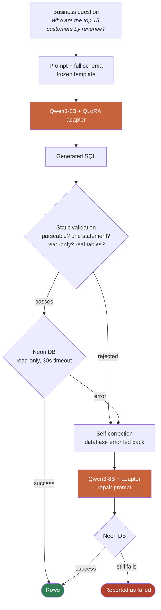

# Voice & Text to SQL — QLoRA Fine-Tuning on Enterprise Data

A production-grade NLP pipeline that translates natural language questions into PostgreSQL queries against a real enterprise database. Built to close the gap between a raw instruction-tuned model and a specialist: the fine-tuned configuration scores **70.86% strict execution accuracy** on a held-out test set, up from 10.82% with the base model and the same prompt.

The repository covers the complete lifecycle: dataset construction, QLoRA fine-tuning on Kaggle, a five-configuration ablation study, a FastAPI production service, voice transcription, and LLM observability.

---

## Results

All numbers are measured on the same 453 held-out test examples, evaluated by executing both the generated SQL and the gold SQL against a live PostgreSQL database and comparing result sets. SQL text is never compared.

### Ablation study — Benchmark v1

| # | Configuration | Strict EX | Executable SQL | Schema Hallucination |
|---|---|---:|---:|---:|
| 1 | Base model, full schema | 10.82% | 98.90% | 0.66% |
| 2 | Base + schema retrieval | 9.27% | 92.27% | 3.31% |
| 3 | Fine-tuned, full schema | 50.99% | 95.81% | 1.99% |
| 4 | Fine-tuned + schema retrieval | 41.72% | 94.92% | 3.53% |
| 5 | Fine-tuned + repair | **52.10%** | 98.23% | 0.66% |

### Ablation study — Benchmark v2 (business glossary + revised prompts)

| # | Configuration | Strict EX | Executable SQL |
|---|---|---:|---:|
| 1 | Base model + prompt v2 | 43.71% | 95.58% |
| 3 | Fine-tuned + prompt v2 | 68.43% | 94.48% |
| 5 | Fine-tuned + repair + prompt v2 | **70.86%** | 98.23% |

### Accuracy by difficulty tier (v2, best configuration)

| Tier | n | Base | Fine-tuned | Fine-tuned + Repair |
|---|---:|---:|---:|---:|
| Easy | 126 | 92.9% | 100.0% | 100.0% |
| Medium | 63 | 69.8% | 96.8% | 96.8% |
| Hard | 144 | 7.6% | 54.9% | 62.5% |
| Very Hard | 36 | 0.0% | 13.9% | 13.9% |
| Enterprise | 84 | 31.0% | 46.4% | 46.4% |

### Self-correction (repair loop, v2)

| Metric | Value |
|---|---:|
| Queries retried after failure | 25 |
| Now execute successfully | 17 (68.0%) |
| Now return correct rows | 11 (44.0%) |
| Model returned identical SQL | 5 |
| Mean repair latency | 15,448 ms |

---

## Architecture



**Deployment:** The service runs the base model (43.71%) behind prompt v2 on Render's free tier. The fine-tuned adapter (70.86%) requires GPU and is served via the Hugging Face Space.

- Live API: `[Add your Render URL here]`
- Hugging Face Space: `[Add your HF Space URL here]`

---

## Dataset

| Property | Value |
|---|---|
| Source | Custom enterprise schema (12 tables, 61 MB of data) |
| Templates | 74 query templates |
| Train split | 2,133 examples |
| Validation split | Held out for retrieval tuning and prompt development |
| Test split | 453 examples — never modified, never trained on |
| Test file fingerprint | `ec7ddcae4f9d90d4` (SHA-256 first 16 hex chars) |
| Format | Chat messages (system + user + assistant = gold SQL) |

The test set fingerprint is verified in CI on every commit. If the file changes, the build fails.

**Why a custom dataset over Spider/BIRD:**
Spider and BIRD have public solutions, walkthroughs, and published baseline numbers, making contamination straightforward. A domain-specific schema with a sealed test set produces numbers that are genuinely comparable and cannot be gamed by memorization.

---

## Fine-Tuning

| Parameter | Value |
|---|---|
| Base model | Qwen/Qwen3-8B |
| Method | QLoRA (r=16, alpha=32, dropout=0.05) |
| Quantization | 4-bit (bitsandbytes NF4) |
| Epochs | 1 |
| Training examples | 2,133 |
| Loss | Completion-only (gold SQL tokens only) |
| Thinking mode | Disabled (/no_think) — matches baseline inference |
| Platform | Kaggle (2× T4 GPUs, free tier) |
| Trainer | HuggingFace TRL SFTTrainer |

Training was done on Kaggle free GPUs to remain reproducible without a paid compute budget. The adapter was uploaded to HuggingFace Hub and is served remotely — no GPU is required at inference time on Render.

---

## Schema Retrieval Finding

The ablation explicitly tested keyword-based schema retrieval (k=4 tables, foreign-key expansion depth 2). Retrieval **hurt** performance: strict accuracy fell from 10.82% to 9.27% on the base model and from 50.99% to 41.72% on the fine-tuned model.

The likely cause: the schema is 12 tables, small enough that the full context fits in 5,455 characters. Retrieval introduces selection errors that cost more than the tokens saved. This is documented rather than hidden because a technique that degrades performance on this schema is a result, not a failure.

---

## Prompt Versioning

Two prompt versions are version-controlled and fingerprinted:

| Version | Fingerprint | Description |
|---|---|---|
| v1 | `8288e41a496531a9` | Original baseline prompt. Frozen — all published v1 numbers were measured against this exact text. |
| v2 | Different fingerprint | Adds business glossary (revenue = sum of `order_items.unit_price * quantity`), a `DATA_AS_OF` reference date anchor, and explicit NULL-handling conventions. Worth +9.47 pp on the base model (34.22% → 43.71%). |

A test (`test_v1_prompt_is_still_the_frozen_baseline_prompt`) verifies the fingerprint on every commit. Any unintentional prompt edit fails the build.

---

## Tech Stack

| Layer | Technology |
|---|---|
| Language model | Qwen/Qwen3-8B (base + QLoRA adapter) |
| Fine-tuning | HuggingFace TRL (SFTTrainer), PEFT (LoRA), bitsandbytes (4-bit) |
| SQL parsing & validation | sqlglot |
| Voice STT | Gemini Speech API / OpenAI Whisper / HF Whisper-large-v3 |
| API framework | FastAPI + uvicorn |
| Database | PostgreSQL (Neon serverless) |
| Inference backend | HuggingFace Inference Providers (featherless-ai, nscale) |
| Containerization | Docker + Docker Compose |
| CI/CD | GitHub Actions (ruff lint + pytest) |
| Deployment | Render (web service, free tier) |
| LLM Observability | LangSmith (traces, execution scores) + Langfuse (optional) |
| Voice Evaluation | jiwer (WER, MER, WIL) |
| LLM Evaluation | Custom harness (execution accuracy, valid-SQL rate, schema compliance) |

---

## Production API

The FastAPI service exposes:

| Endpoint | Method | Description |
|---|---|---|
| `/query` | POST | Accepts a natural language question, returns SQL, result rows, latency breakdown |
| `/voice` | POST | Accepts audio file, returns transcript (feed to `/query`) |
| `/health` | GET | Database and model readiness check |
| `/metrics` | GET | Live operational metrics (success rate, latency averages, top tables) |
| `/schema` | GET | Schema context fingerprint and table list |
| `/docs` | GET | Interactive OpenAPI documentation |

**Safety design:**
- Every connection is configured `default_transaction_read_only` before execution
- Static validation (sqlglot) rejects write statements, unknown tables, and unknown columns before any database round-trip
- A bad question returns HTTP 200 with `ok: false` — 5xx is reserved for the service being broken, not for a model producing wrong SQL
- CORS is scoped to `*.hf.space` only, never `*`

---

## Observability

**LangSmith** (active when `LANGSMITH_API_KEY` is configured):
- Traces every `/query` and `/voice` call with full input/output, model metadata, and latency breakdown
- Posts `execution_accuracy` scores (1.0 on success, 0.0 on failure) to the LangSmith dashboard
- Supports regional endpoints (`LANGSMITH_ENDPOINT` for APAC keys)

**Built-in `/metrics` endpoint** (no credentials required):
- Total queries, success rate %, repair rate
- Average latency breakdown (generation, execution, total)
- Top queried tables, error stage distribution

**Structured JSON logs** on every request — pipe to any log aggregator (Datadog, CloudWatch, Render Logs).

---

## Repository Structure

```
.
├── dataset/                  # Benchmark dataset (train/validation/test splits)
│   ├── generation/           # Template-based question generation (v1 and v2)
│   ├── formatting/           # SFT chat format conversion
│   └── sft/                  # Final training files + manifest
├── src/
│   ├── api/                  # FastAPI application
│   │   ├── main.py           # Endpoints, CORS, lifespan
│   │   ├── service.py        # Pipeline orchestration
│   │   ├── observability.py  # Metrics, LangSmith, Langfuse
│   │   └── schemas.py        # Pydantic request/response models
│   ├── evaluation/           # Evaluation harness
│   │   ├── baseline.py       # Concurrent benchmark runner
│   │   ├── metrics.py        # Outcome classification
│   │   ├── llm_eval.py       # Execution accuracy, valid-SQL, schema compliance
│   │   └── voice_eval.py     # WER, MER, WIL via jiwer
│   ├── model/                # Prompt versions and schema context builder
│   ├── sql/                  # Validator, executor, repair, config
│   └── retrieval/            # Keyword schema retriever
├── experiments/              # All ablation results (frozen)
│   ├── ABLATION.md           # v1 five-configuration study
│   └── v2/ABLATION.md        # v2 three-configuration study
├── scripts/                  # Evaluation, export, reporting scripts
├── training/kaggle/          # QLoRA training notebook
├── deploy/
│   ├── space/                # HuggingFace Space (Gradio UI)
│   └── DEPLOY.md             # Step-by-step deployment guide
├── tests/                    # 166 pytest tests across all layers
├── .github/workflows/ci.yml  # Lint + test pipeline
├── Dockerfile                # Production container
├── docker-compose.yml        # Local stack (API + PostgreSQL)
└── render.yaml               # Render Blueprint (one-click deploy)
```

---

## CI/CD

GitHub Actions runs on every push to `main`:
1. Linting with `ruff`
2. Full `pytest` suite (166 tests) including database integrity, API, security, evaluation harness, and observability tests
3. Test set fingerprint verification (fails the build if `dataset/test/test.jsonl` changes)

The CI connects to the real Neon PostgreSQL database via GitHub Secrets for database tests.

---

## Deployment

The service deploys to Render in three steps using the included `render.yaml` Blueprint:

1. **Neon** — create a PostgreSQL project, seed it with the enterprise schema and data
2. **Render** — connect the repository, select Blueprint, fill in 5 environment variable secrets
3. **Verify** — `curl https://<your-app>.onrender.com/health` returns `{"status":"ok","database":true}`

Full instructions in [`deploy/DEPLOY.md`](deploy/DEPLOY.md).

**Limitations of the free deployment:**
- Serves the base model (43.71%) — the fine-tuned adapter needs GPU
- Render free tier sleeps after 15 minutes idle, first request takes ~50 seconds
- The fine-tuned model (70.86%) is available on the HuggingFace Space

---

## Running Locally

```bash
git clone https://github.com/garvit-010/Voice-Text-to-SQL-FineTuning
cd Voice-Text-to-SQL-FineTuning
python -m venv env && env\Scripts\activate
pip install -r requirements.txt
cp .env.example .env  # fill in credentials
uvicorn src.api.main:app --reload
```

```bash
# Or with Docker
docker-compose up
```

Tests:
```bash
pytest tests/ -v
```

---

## Reproducing the Numbers

```bash
# Benchmark v1, best configuration (fine-tuned + repair)
python scripts/score_repair.py --version v1

# Benchmark v2, best configuration
python scripts/score_repair.py --version v2

# Ablation report
python scripts/ablation_report.py
```

All results are deterministic: `temperature=0.0`, `seed=20260808`, frozen test set.
